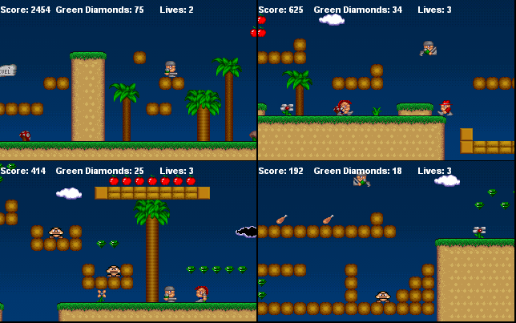



## Soldier of Misfortune

### Description

Very nice 2d arcade side-scrooling directx7 game, there are sounds, music, nice graphics, 4 levels, bunch of monsters, all that 2d game must have. If you like Super Mario, then you WILL like this game. I wrote it a year ago, and dont have time to add more levels (there are 4 only, about 30 minutes to play).

Please vote if you liked it.
 
### More Info
 

             |
---                |---
**Submitted On**   |2004-01-31 15:35:40
**By**             |[TheAlas\.com](https://github.com/Planet-Source-Code/PSCIndex/blob/master/ByAuthor/thealas-com.md)
**Level**          |Intermediate
**User Rating**    |5.0 (60 globes from 12 users)
**Compatibility**  |VB 4\.0 \(32\-bit\), VB 5\.0, VB 6\.0
**Category**       |[Games](https://github.com/Planet-Source-Code/PSCIndex/blob/master/ByCategory/games__1-38.md)
**World**          |[Visual Basic](https://github.com/Planet-Source-Code/PSCIndex/blob/master/ByWorld/visual-basic.md)
**Archive File**   |[Soldier\_of1761176232004\.zip](https://github.com/Planet-Source-Code/thealas-com-soldier-of-misfortune__1-54558/archive/master.zip)

### API Declarations

a few

